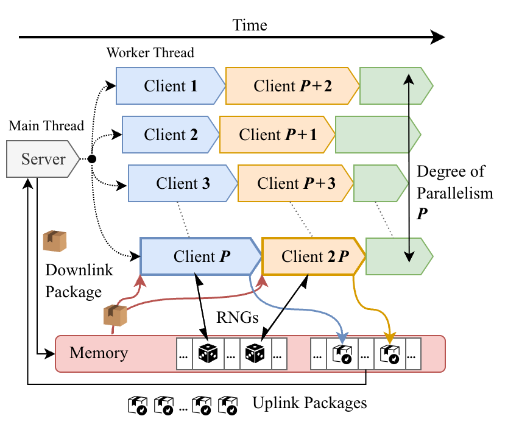

.. image:: _static/logo.svg
   :align: center
   :width: 80%
   :class: dark-light

|

.. raw:: html

   

     
     
     
     
     
   

|

What is BlazeFL?
================

**BlazeFL** is a lightweight framework for single-node Federated Learning (FL) simulation that eliminates the trade-off between **throughput** and **reproducibility**. By leveraging Python's free-threading architecture, BlazeFL allows for shared-memory execution that bypasses the heavy overhead of inter-process communication (IPC) and serialization.

   Architecture overview: Shared-memory execution eliminates serialization/IPC overhead. Isolated RNG streams ensure deterministic results.

Feature Highlights
==================

- 🚀 **Zero-Copy Parallelism**: Uses thread-based parallelism (PEP 703) to exchange model parameters via shared memory. Achieve up to **3.1x speedup** on communication-heavy workloads compared to traditional process-based frameworks.
- 🔄 **Bitwise Reproducibility**: Guarantees identical results across runs, even with high concurrency. By assigning isolated RNG streams to each client, BlazeFL eliminates non-determinism caused by worker scheduling or completion-order-dependent aggregation.
- 🧩 **No Framework Lock-in**: Built on Python ``Protocols``. Integrate your existing PyTorch models and training loops with minimal changes. No rigid inheritance required.
- 🍃 **Minimalist Stack**: Core execution relies only on PyTorch and Python standard libraries. Lightweight, easy to package, and highly portable.

Quick Look
==========

BlazeFL keeps the simulation loop explicit and easy to debug. Here is the core pattern:

.. code-block:: python

   # Server-Client interaction is straightforward
   while not handler.is_stopped():
       # 1. Server: Sample clients and prepare downlink
       sampled_clients = handler.sample_clients()
       broadcast = handler.downlink_package()

       # 2. Client Trainer: Process clients in parallel (Threads/Processes)
       trainer.local_process(broadcast, sampled_clients)
       uploads = trainer.uplink_package()

       # 3. Server: Aggregate uploads
       for pack in uploads:
           handler.load(pack)

Execution Modes
===============

BlazeFL offers three execution modes to suit your environment:

1. **Multi-Threaded (Recommended)**: Best for Python 3.14+ (Free-threading). Zero-copy sharing and minimal overhead.
2. **Multi-Process**: Utilizes separate processes to achieve isolation. Uses shared-memory tensors for efficient parameter exchange.
3. **Single-Threaded**: Simple, sequential execution. Perfect for debugging and initial prototyping.

Robust Reproducibility
======================

Parallel execution often breaks reproducibility due to floating-point rounding differences and global random state interference. BlazeFL solves this with a **Generator-Based Strategy**:

1. Each client is assigned a dedicated **RNGSuite**.
2. Random operations (sampling, shuffling, augmentation) consume these client-isolated generators.
3. Results are materialized in a deterministic order, ensuring bitwise-identical aggregation.

.. tip::
   To ensure full determinism in vision pipelines, use transforms that accept explicit generators. BlazeFL provides utilities to snapshot and restore these states seamlessly.

Benchmarks
==========

In image classification experiments (CIFAR-10), BlazeFL substantially reduces execution time relative to widely used frameworks. The performance advantage is most pronounced in workloads where parameter exchange is the primary bottleneck.

.. list-table::
   :widths: 50 50
   :header-rows: 0

   * - .. image:: _static/benchmark_cnn.png
          :width: 100%
     - .. image:: _static/benchmark_resnet18.png
          :width: 100%

Citation
========

.. code-block:: bibtex

   @misc{azuma2026blazeflfastdeterministicfederated,
         title={BlazeFL: Fast and Deterministic Federated Learning Simulation}, 
         author={Kitsuya Azuma and Takayuki Nishio},
         year={2026},
         eprint={2604.03606},
         archivePrefix={arXiv},
         primaryClass={cs.LG},
         url={https://arxiv.org/abs/2604.03606}, 
   }

Contents
========

.. toctree::
   :maxdepth: 2

   reference
   contribute
